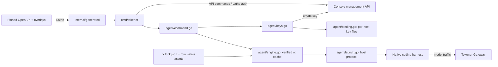

# tokener-cli

`tokener` is the command-line client for the Tokener.ai Console Management API.
It authenticates with a Tokener.ai management personal access token (PAT,
prefix `tkr_pat_`) and exposes the console management surface — API keys,
billing balance and ledger, usage, and the public model catalog.

It is not the LLM data plane: model traffic goes to the Tokener Gateway with a
Tokener.ai API key, not to this CLI.

## Architecture



`host.go` resolves the management host and its gateway. Agent keys stay in
per-host config files; only the default host reads the legacy `agent-key.json`.
`atomicfile` owns temporary-file writes and platform-specific replacement for
bindings, cached engines, and the snapshot lock. Engine extraction verifies
SHA-256, retains old digest directories for rollback, and validates `TOKENER_RX`
overrides through the rx host handshake. The launch request contains the gateway
profile; its credential travels separately in `TOKENER_API_KEY`.

`make cli-sync` rebuilds the management commands and bundled Skill from the
pinned spec, overlay, and `internal/skill-include/`. The Skill discovers commands
through the binary's catalog. `refresh-rx.yml` builds and probes four native
engines, records their source and checksums, and opens a snapshot PR. Release
tags run `make ci-check` before GoReleaser packages the binaries and opens the
Homebrew update PR.

## Install

Install the latest release on macOS or Linux:

```sh
curl -fsSL https://tokener.dev/install.sh | sh
```

Install with Homebrew:

```sh
brew tap langgenius/tokener https://github.com/langgenius/tokener-cli
brew install langgenius/tokener/tokener
```

Upgrade an existing installation with `tokener update` or `brew upgrade
tokener`, depending on how it was installed. Windows archives are available on
the [GitHub Releases](https://github.com/langgenius/tokener-cli/releases) page.

## Layout

| Path | Owner |
| --- | --- |
| `specs/sources.yaml` | spec source declaration for `lathe specsync`, pinned to an upstream tag |
| `cli.yaml` | generated CLI identity, auth validation, skill, and update config |
| `overlays/console.yaml` | human-facing command names, help, examples, and parameter presentation |
| `cmd/tokener/main.go` | runtime entrypoint and auth-login defaults |
| `internal/agent/` | key lifecycle, host selection, engine extraction, and launch |
| `internal/rxsnapshot/` | embedded engine provenance and artifact verification |
| `internal/skill-include/` | authored Skill instructions and catalog protocol |
| `internal/generated/` | generated command specs (do not edit) |
| `skills/tokener/` | generated agent Skill (do not edit) |

## Build

```sh
make cli-sync    # regenerate from spec/ and cli.yaml, then go mod tidy
make cli-build   # build bin/tokener
make check       # cli-sync + tests + go vet
make release-snapshot # build release artifacts without publishing
```

`make cli-sync` runs the pinned `lathe` generator via `go run`; override the
version with `make cli-sync LATHE_VERSION=vX.Y.Z`.

## Generated output

`internal/generated/`, `skills/tokener/`, and `cmd/tokener/cli.yaml` are
generated by `lathe`. Do not hand-edit them. To change CLI behavior, change
`cli.yaml`, `specs/sources.yaml`, `overlays/console.yaml`, or the upstream spec,
then re-run `make cli-sync` and commit the regenerated output with the change.

## Usage

```sh
bin/tokener auth login
bin/tokener auth login --no-browser
bin/tokener auth login --with-token
bin/tokener commands --json
bin/tokener commands show keys create --json
bin/tokener keys list -o json
bin/tokener billing ledger --all -o json
```
